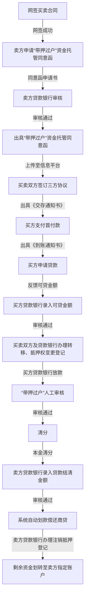

```mermaid
graph TD
A[网签买卖合同] -->|网签成功| B[卖方申请“带押过户”资金托管同意函]
B -->|同意函申请书| C[卖方贷款银行审核]
C -->|审核通过| D[出具“带押过户”资金托管同意函]
D -->|上传至信息平台| E[买卖双方签订三方协议]
E -->|出具《交存通知书》| F[买方支付首付款]
F -->|出具《到账通知书》| G[买方申请贷款]
G -->|反馈可贷金额| H[买方贷款银行录入可贷金额]
H -->|审核通过| I[买卖双方及贷款银行办理转移、抵押权变更登记]
I -->|买方贷款银行放款| J[“带押过户”人工审核]
J -->|审核通过| K[清分]
K -->|本金清分| L[卖方贷款银行录入贷款结清金额]
L -->|审核通过| M[系统自动划款偿还商贷]
M -->|卖方贷款银行办理注销抵押登记| N[剩余资金划转至卖方指定账户]
```