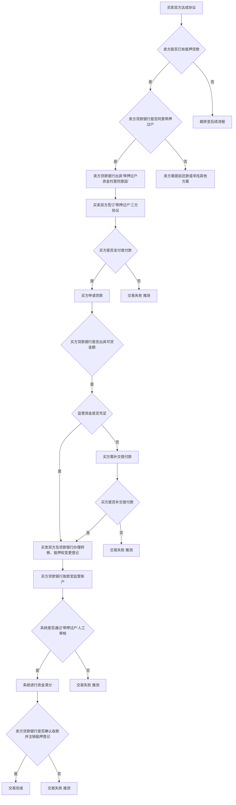

```mermaid
 graph TD
    A[买卖双方达成协议] --> B{卖方是否已有抵押贷款}
    B -- 是 --> C{卖方贷款银行是否同意带押过户}
    C -- 是 --> D[卖方贷款银行出具'带押过户资金托管同意函']
    C -- 否 --> E[卖方需提前还款或寻找其他方案]
    B -- 否 --> F[跳转至后续流程]
    D --> G[买卖双方签订'带押过户'三方协议]
    G --> H{买方是否支付首付款}
    H -- 是 --> I[买方申请贷款]
    H -- 否 --> J[交易失败 推测 ]
    I --> K{买方贷款银行是否出具可贷金额}
    K -- 是 --> L{监管资金是否充足}
    L -- 是 --> M[买卖双方及贷款银行办理转移、抵押权变更登记]
    L -- 否 --> N[买方需补交首付款]
    N --> O{买方是否补交首付款}
    O -- 是 --> M
    O -- 否 --> P[交易失败 推测 ]
    M --> Q[买方贷款银行放款至监管账户]
    Q --> R{系统是否通过'带押过户'人工审核}
    R -- 是 --> S[系统进行资金清分]
    R -- 否 --> T[交易失败 推测 ]
    S --> U{卖方贷款银行是否确认收款并注销抵押登记}
    U -- 是 --> V[交易完成]
    U -- 否 --> W[交易失败 推测 ]

```