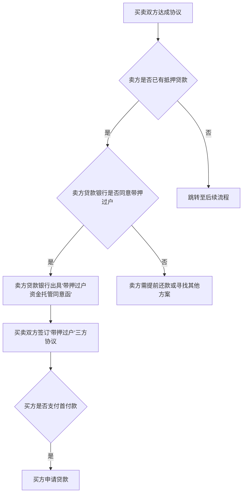

```mermaid
 graph TD
    A[买卖双方达成协议] --> B{卖方是否已有抵押贷款}
    B -- 是 --> C{卖方贷款银行是否同意带押过户}
    C -- 是 --> D[卖方贷款银行出具'带押过户资金托管同意函']
    C -- 否 --> E[卖方需提前还款或寻找其他方案]
    B -- 否 --> F[跳转至后续流程]
    D --> G[买卖双方签订'带押过户'三方协议]
    G --> H{买方是否支付首付款}
    H -- 是 --> I[买方申请贷款]

```